Railstraunt is a full stack restaurant order and menu management system.  I built the backend with Ruby and Ruby on Rails.  For the front end, I used Bourbon for styling, with some JQuery for a slide out menu and some minor DOM manipulation.  The database is managed with Postgres, and consists of six tables:

>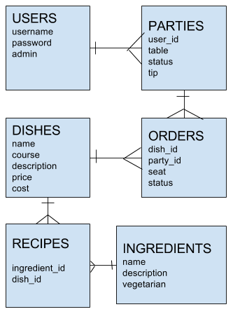

There are three intended users for this application: servers, chefs, and managers (admins) of restaurants.  There are three different types of accounts for each of these users, each with different abilities.

The main purpose for a server is to have the ability to assign a party of guests to a table, and to assign food orders to a particular seat at that table.  First, the user adds a party by selecting which table they are sitting at.  Then it will appear on the main server view page which shows all of the user's open tables.

>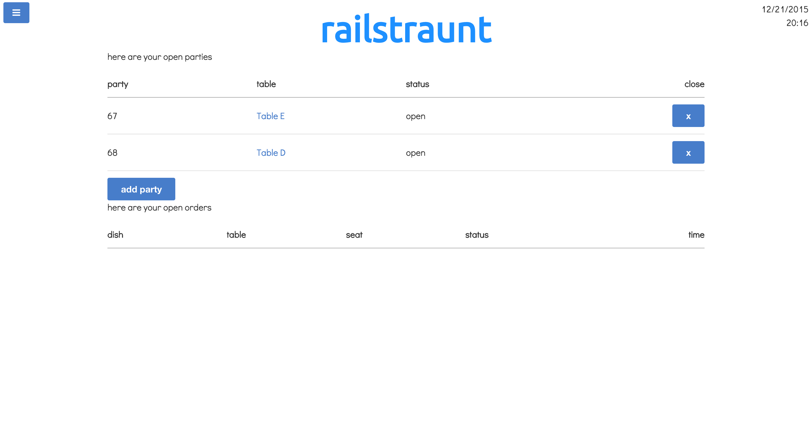

When the user clicks on the table, it goes to the party view page, where they can assign menu items to a particular seat via two dropdown menus.

>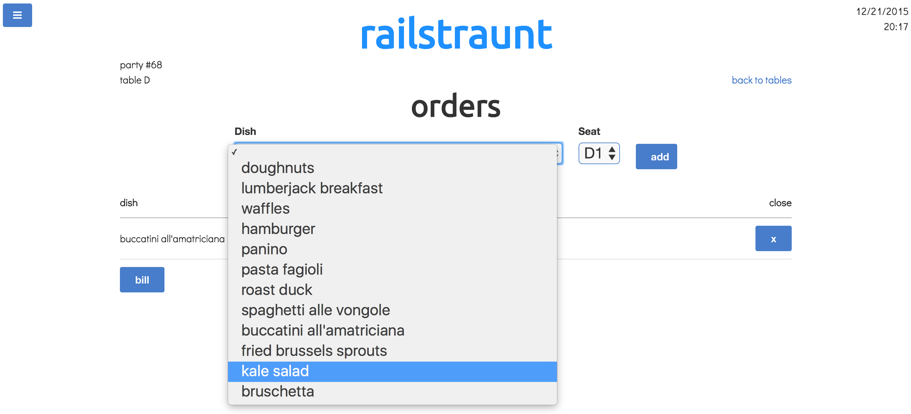

As the user assigns orders to seats, they will appear on the party view page for that party.  If the user goes back to view all of the tables they have assigned to them, they will be able to see all of the outstanding orders and their status.

>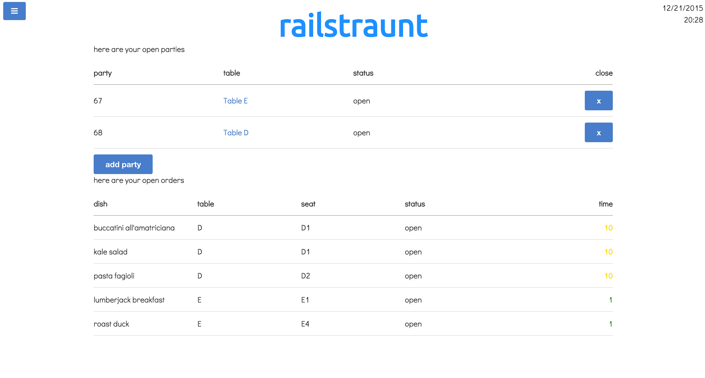

As the kitchen makes the orders and marks them as closed, the orders in the server's view will show the updated status.  When a table is ready to get their bill, the server can pull up the bill page, and all of the orders that haven't been paid for yet will appear, along with a tip dropdown to automatically add the tip.

>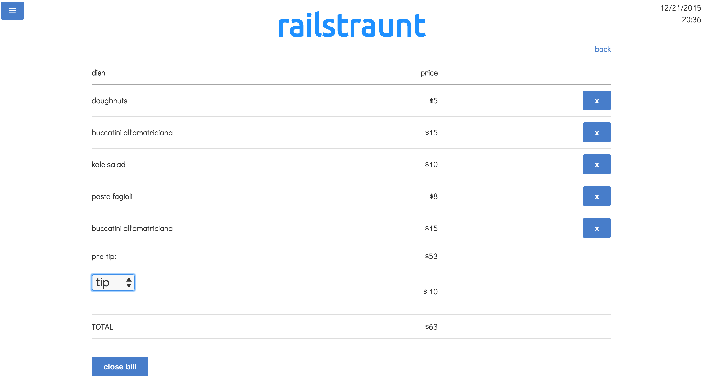

The navigation on the application is mainly done through the slide out menu on the left.  Since there are three different types of users, the navigation bars show different things depending on who is logged in.

>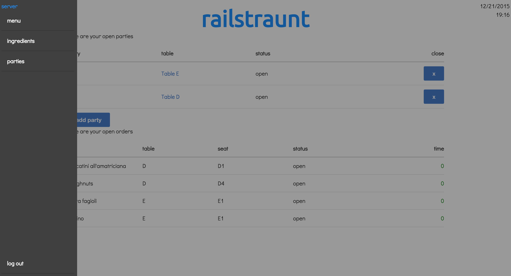
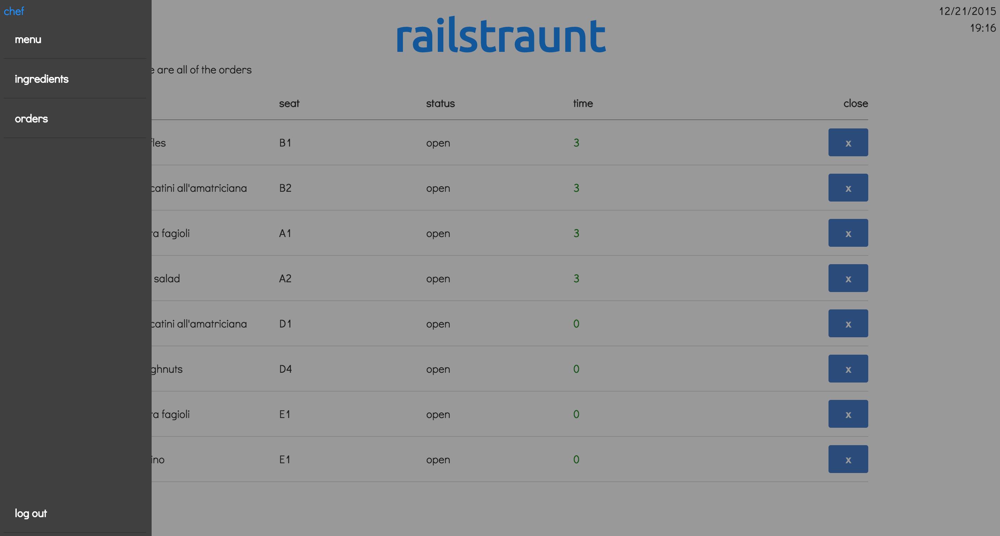
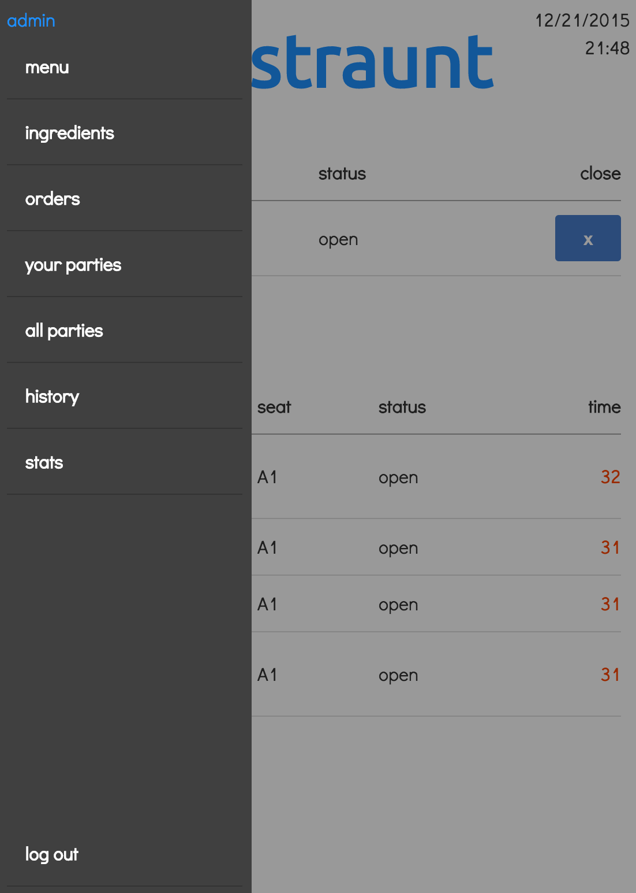

As the servers assign orders, the chefs have the ability to see all of the outstanding orders.  They can also see the number of minutes it has been since the order was put in.  This number changes color based on how long it has been.  It will show green for under 10 minutes, yellow for 10-20, orange for 20-30 and red for 30 or more.

>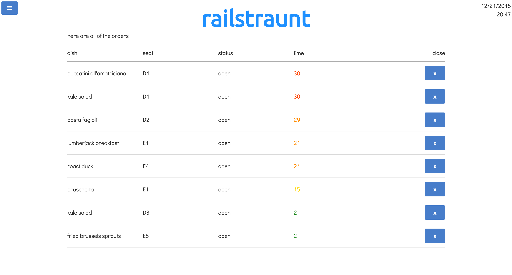

Any user can also see the menu and ingredient pages, which show all of the food items available, along with ingredients.  In both of these views, The chefs and servers can only see them, while the admin has the additional ability to add and delete items.

>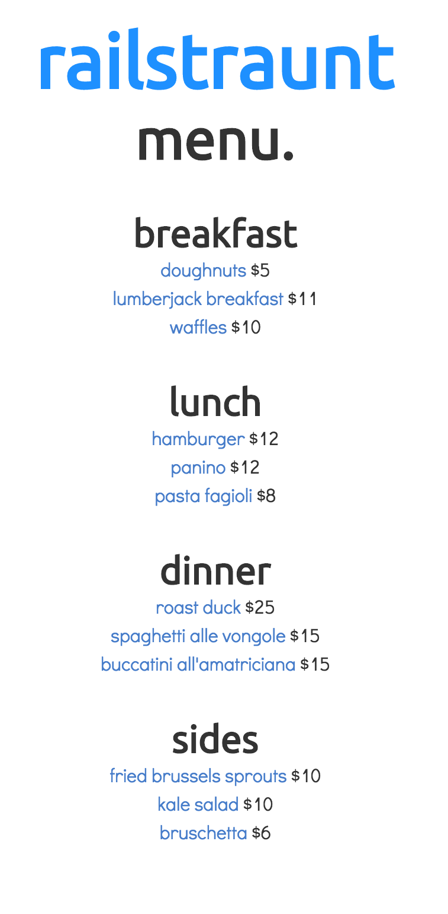
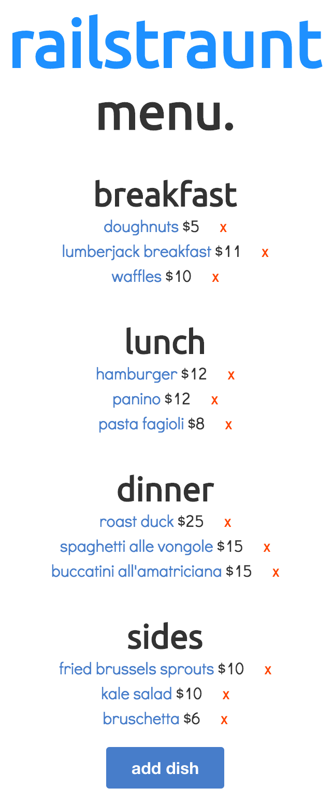

The admin has all of the views available to chefs and servers with a few extras available.  They have the ability to view a dish and add ingredients to it.  Eventually I would like to add some functionality where a server could automatically filter out an item that has a particular type of ingredient, in case the guest has a particular type of eating restriction.  But for now, the admin can add ingredients to the dish and they will appear on this page.

>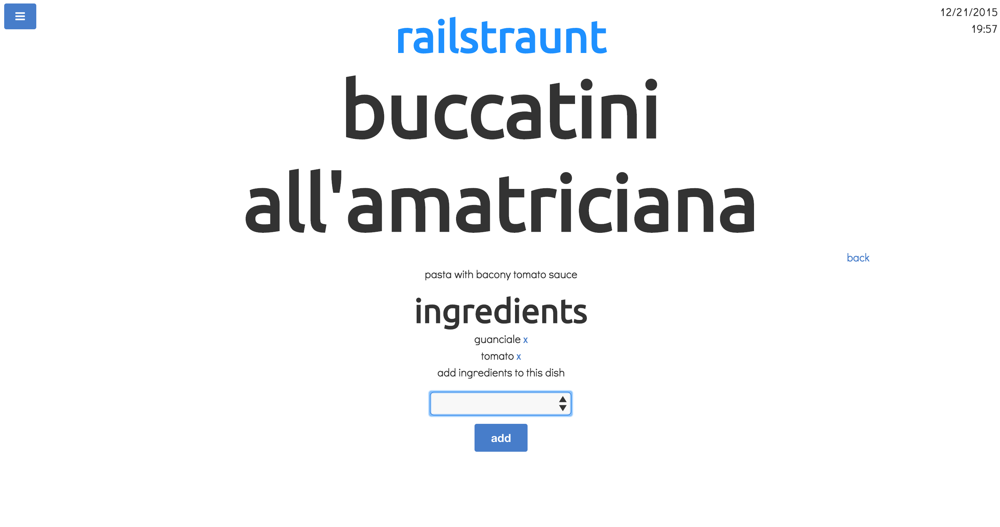

Admins have ability to see all of the tables in the restaurant and which server they are assigned to. Additionally, as orders are marked as open, closed, and paid, they are never actually deleted from the database.  So the admin also has the ability to see the order history, and a stats page which shows various statistics about the restaurant's order history.

>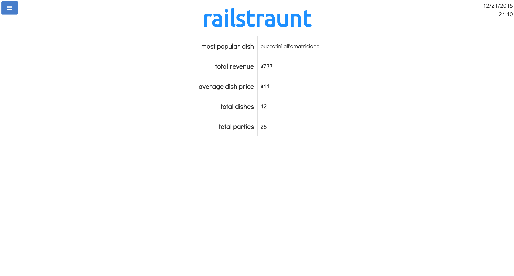

The mobile view for this site was designed with the server's use in mind, it displays less information than the desktop view, but it still shows the user necessary information in a clean an organized way.

 
>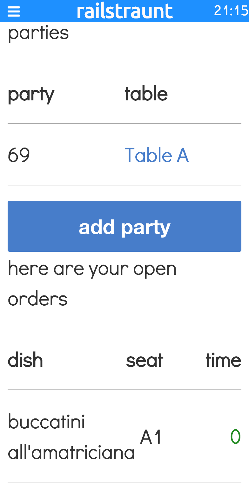
>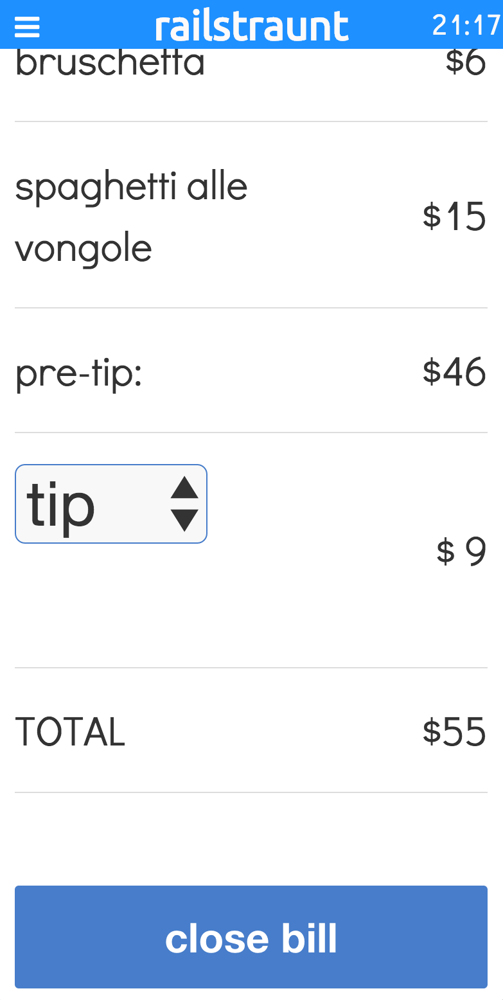
